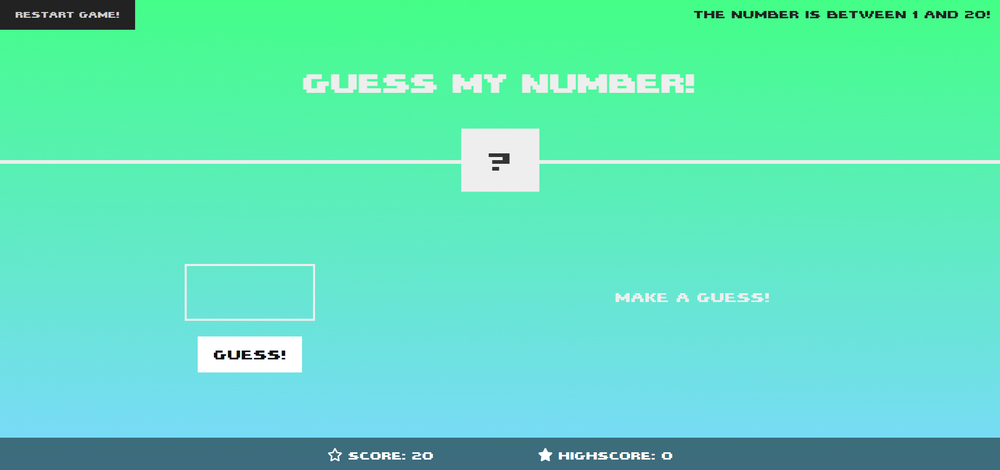

# 🎯 Guess My Number Game

A fun, interactive web game where players try to guess a randomly generated number between 1 and 20. Built using HTML, CSS, and JavaScript.

## 🚀 Live Demo

👉 [Play the game here](https://thecodingkoala912.github.io/NumberGame/)

---

## 🚀 Features

* Random number generation between 1 and 20  
* Input validation with helpful user alerts  
* Dynamic UI feedback for correct, incorrect, and invalid inputs  
* Score tracking and high score display  
* Colorful animations and responsive design  
* Restart button to play again without refreshing the page  

## 🖼️ Demo

## 🛠️ Technologies Used

* HTML5  
* CSS3 (with external fonts and FontAwesome icons)  
* JavaScript (Vanilla JS, no frameworks)  

## 📦 File Structure

